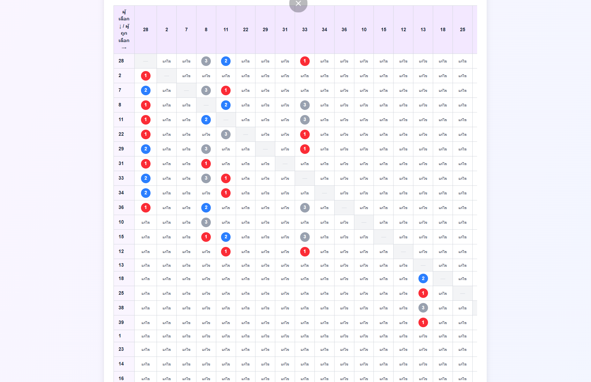
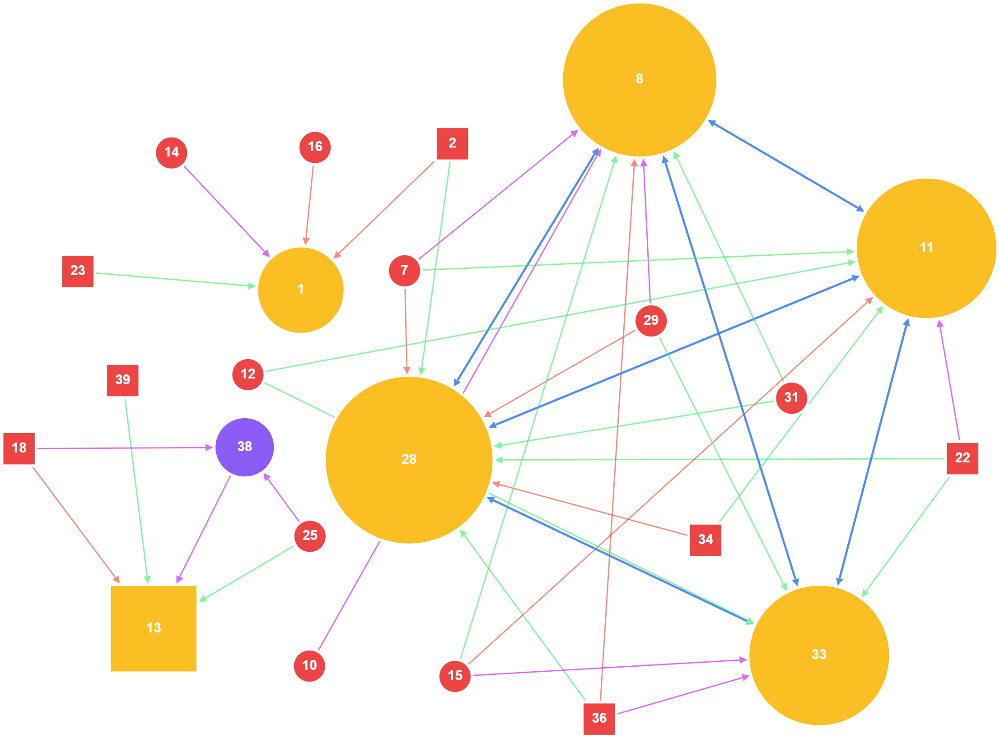
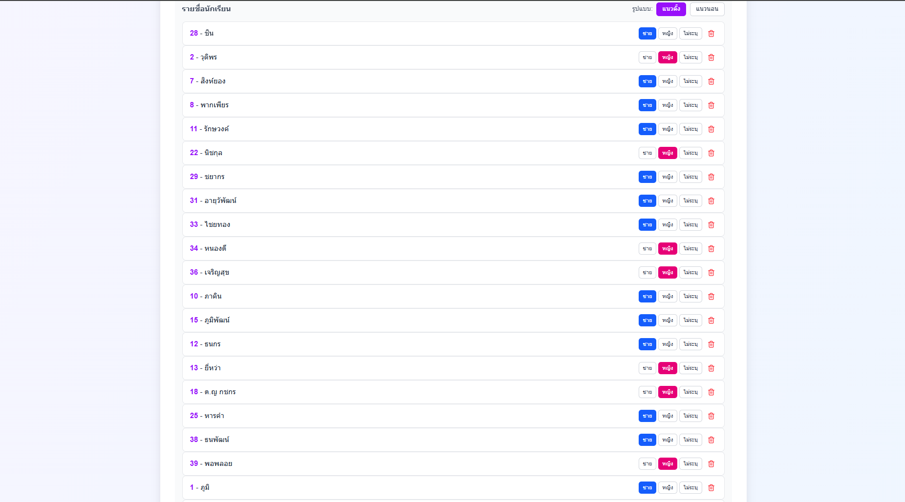
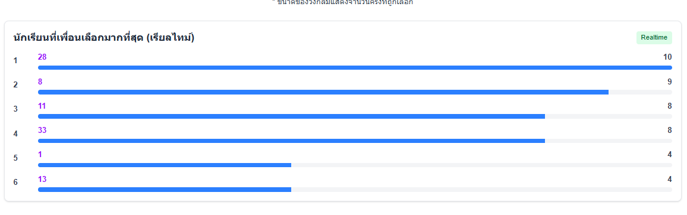

# Socigram

Social diagram tools for connecting children in the classroom.


## 📸 Screenshots

<div align="center">
<table>
<tr>
<td></td>
<td></td>
</tr>
<tr>
<td></td>
<td></td>
</tr>
</table>
</div>

## Getting Started

### 1. Install dependencies

```bash
npm install
```

If installation fails with errors, try one of the following:

```bash
npm install --force
# or
npm install --legacy-peer-deps
```

### 2. Run the development server

```bash
npm run dev
```

Then open your browser and go to:

```
http://localhost:3000
```

## Electron (Desktop App)

To build the desktop application:

```bash
npm run dist
```

The installer will be generated in the `dist` folder (e.g. `YourAppName Setup 0.1.0`).

## Notes

- Data is stored locally using `localStorage`.

## License

This project is licensed under the MIT License. See the [LICENSE](./LICENSE) file for details.